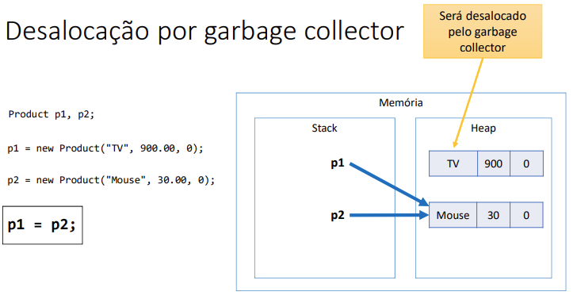
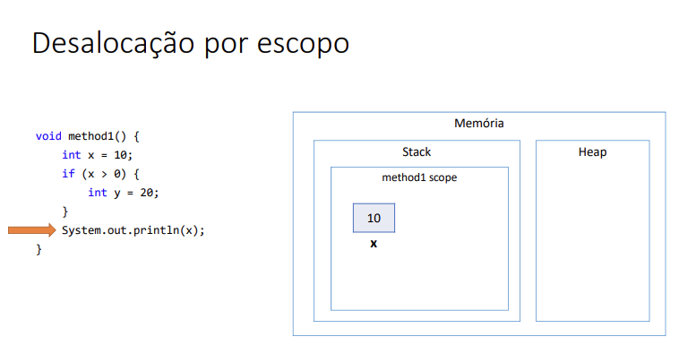
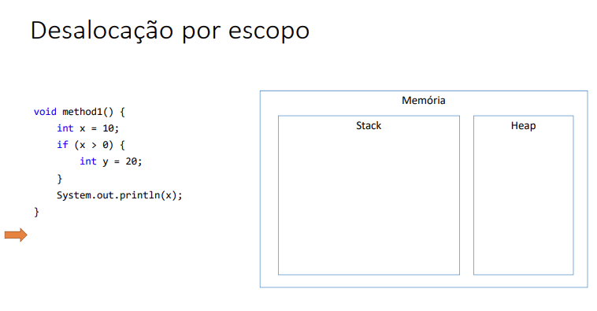
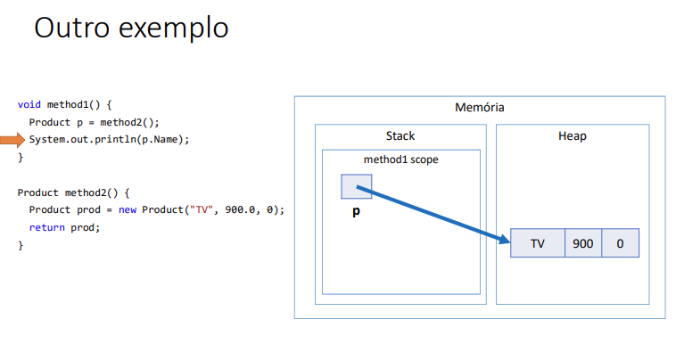

# Desalocação de memória - garbage collector e escopo local

## Garbage collector
* É um processo que automatiza o gerenciamento de memória de um programa em execução
* O garbage collector monitora os objetos alocados dinamicamente pelo programa (no heap), desalocando aqueles que não estão mais sendo utilizados.

## Desalocação por escopo 
* Quando uma variável é inicializada dentro de um IF ela será existente pelo tempo em que o laço for existente, após o laço ser finalizado ela é extinta da memória.

* 
* 

### Resumo 
* Objetos alocados dinamicamente, quando não possuem mais referência para eles, serão desalocados pelo garbage collector
* Variáveis locais são desalocadas imediatamente assim que seu escopo local sai de execução