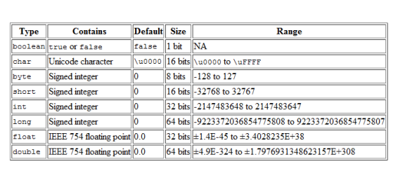
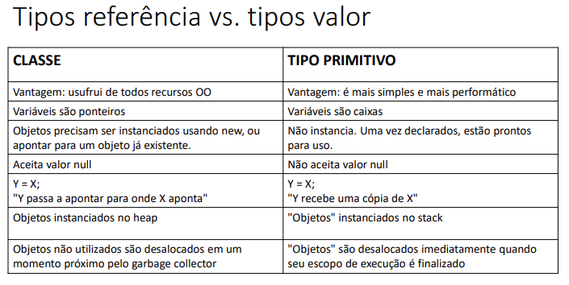

# Tipos referência vs. tipos valor

## Classes são tipos referência
* Variáveis cujo tipo são classes não devem ser entendidas como caixas, mas sim “tentáculos” (ponteiros) para caixas
  * Dentro da memória existem Stack e Heap
    * Stack - É a área de memória onde é armazenado as variáveis que você declara
    * Heap - É aonde são alocados os objetos em tempo de execução, ou seja alocação dinâmica de memória

## Valor "null"
* Tipos referência aceitam o valor "null", que indica que a variável aponta pra ninguém.

## Tipos primitivos são tipos valor
* Em Java, tipos primitivos são tipos valor. Tipos valor são CAIXAS e não ponteiros. 

## Tipos primitivos e inicialização
```java
/*int p;
System.out.println(p); // erro: variável não iniciada*/
```
```java
/*p = 10;
System.out.println(p);*/
```

## Valores padrão
* Quando alocamos (new) qualquer tipo estruturado (classe ou array), são atribuídos valores padrão aos seus elementos
  * números: 0
  * boolean: false
  * char: caractere código 0
  * objeto: null


## Diferenças

