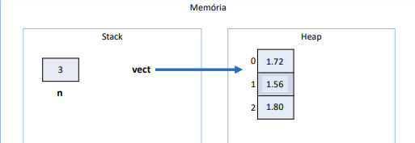
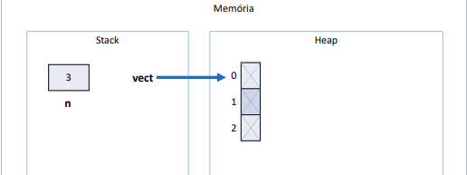
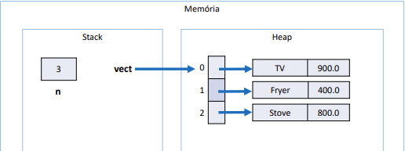

## Vetores

* Em programação, "vetor" é o nome dado a arranjos unidimensionais
* Arranjo (array) é uma estrutura de dados
  * Homogênea (dados do mesmo tipo)
  * Ordenada (elementos acessados por meio de posições)
  * Alocada de uma vez só, em um bloco contíguo de memória

* Vantagens
  * Acesso imediato aos elementos pela sua posição
* Desvantagens
  * Tamanho fixo
  * Dificuldade para se realizar inserções e deleções

## Exemplo 1

### Fazer um programa para ler um número inteiro N e a altura de N pessoas. Armazene as N alturas em um vetor. Em seguida, mostrar a altura média dessas pessoas.
```java
package application;
import java.util.Locale;
import java.util.Scanner;
    public class Program {
        public static void main(String[] args) {
        Locale.setDefault(Locale.US);
        Scanner sc = new Scanner(System.in);
        
        int n = sc.nextInt();
        double[] vect = new double[n];
        
        for (int i=0; i<n; i++) {
        vect[i] = sc.nextDouble();
        }
        
        double sum = 0.0;
        for (int i=0; i<n; i++) {
        sum += vect[i];
        }
        
        double avg = sum / n;
        System.out.printf("AVERAGE HEIGHT: %.2f%n", avg);
        sc.close();
    }
}
```



## Exemplo 2

### Fazer um programa para ler um número inteiro N e os dados (nome e preço) de N Produtos. Armazene os N produtos em um vetor. Em seguida, mostrar o preço médio dos produtos.
```java
package section10exercises;
import java.util.Locale;
import java.util.Scanner;

public class ExemploVetor2 {
    public static void main(String[] args) {
        Locale.setDefault(Locale.US);
        Scanner sc = new Scanner(System.in);
        
        int n = sc.nextInt();
        Product[] vect = new Product[n];
        
        for (int i=0; i < vect.length; i++) {
            sc.nextLine();
            String name = sc.nextLine();
            double price = sc.nextDouble();
            vect[i] = new Product(name, price);
        }
        
        double sum = 0.0;
        for (int i=0; i < vect.length; i++) {
            sum += vect[i].getPrice();
        }
        
        double avg = sum / vect.length;
        System.out.printf("AVERAGE PRICE = %.2f%n", avg);
        
        sc.close();
    }
}
```

```java
public class Produto_ex_v2 {
    private String name;
    private double price;

    public Produto_ex_v2(String name, double price) {
        this.name = name;
        this.price = price;
    }

    public String getName() {
        return name;
    }

    public void setName(String name) {
        this.name = name;
    }

    public double getPrice() {
        return price;
    }

    public void setPrice(double price) {
        this.price = price;
    }
}
```





